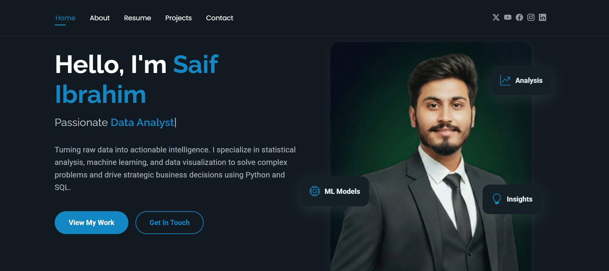

# 👨‍💻 Saif Ibrahim - Data Scientist & Analyst Portfolio



[](http://saifibrahim.netlify.app/)
[](https://www.youtube.com/@NextGenAiHub-i8y)
[](https://www.linkedin.com/in/saif-ibrahim-tech/)
[](https://github.com/TheSaifHub)
[](https://www.instagram.com/nextgen.saif/)

> **"Turning raw data into actionable intelligence."**

## 📖 About The Project

This is my personal portfolio website designed to showcase my journey as a **Data Analyst** and **Aspiring Data Scientist**. It serves as a central hub for my technical projects, professional resume, skills, and content creation work.

The site is built with a **mobile-first** approach, ensuring it looks great on all devices, and hosts my contact forms using **Netlify's** serverless form handling.

### 🌟 Key Features
* **Responsive Design:** Fully adaptive UI for Desktop, Tablet, and Mobile.
* **Dynamic Components:** Header and Footer are loaded dynamically using JavaScript to maintain clean code.
* **Netlify Forms:** Contact form integrated directly with Netlify (No PHP backend required).
* **Project Showcase:** Dedicated section for Data Science, ML, and SQL projects.
* **Interactive UI:** Smooth scrolling and animations using AOS (Animate On Scroll).

## 🛠️ Tech Stack

* **Frontend:** HTML5, CSS3, JavaScript (ES6)
* **Styling:** Bootstrap 5, Custom CSS
* **Icons:** Bootstrap Icons
* **Hosting:** Netlify
* **Version Control:** Git & GitHub

## 🚀 How to Run Locally

Since this project uses JavaScript `fetch` to load the header/footer, you cannot simply open the `index.html` file. You must run a local server.

## 🚀 How to Run On Server

Since this project uses JavaScript to dynamically load the header and footer, you cannot simply open `index.html` by double-clicking it (browsers block local file requests for security). You must use a local server.

### Open UI (Recommended)
1.  Open the project folder in **Visual Studio Code**.
2.  Install the **[Live Server](https://marketplace.visualstudio.com/items?itemName=ritwickdey.LiveServer)** extension.
3.  Right-click on `index.html`.
4.  Select **"Open with Live Server"**.

## 📬 Contact Me

I am currently open to roles in **Data Analytics**, **Machine Learning**, and **Python Development**.

* **Email:** [saifibrahim.up@gmail.com](mailto:saifibrahim.up@gmail.com)
* **LinkedIn:** [Saif Ibrahim](https://www.linkedin.com/in/saif-ibrahim-tech/)
* **YouTube:** [NextGen Ai Hub](https://www.youtube.com/@NextGenAiHub-i8y)
* **Portfolio:** [saif-tech-portfolio.netlify.app](https://saifibrahim.netlify.app/)

## 📂 Project Structure

```text
├── assets/
│   ├── css/        # Main stylesheets
│   ├── img/        # Profile photos and project screenshots
│   ├── js/         # Main JavaScript logic
│   └── vendor/     # Third-party libraries (AOS, Bootstrap, etc.)
├── index.html      # Homepage
├── about.html      # About Me & Resume
├── portfolio.html  # Data Science Projects
├── contact.html    # Contact Form (Netlify connected)
├── header.html     # Reusable Header Component
└── README.md       # Documentation


© 2025 Saif Ibrahim. All Rights Reserved.